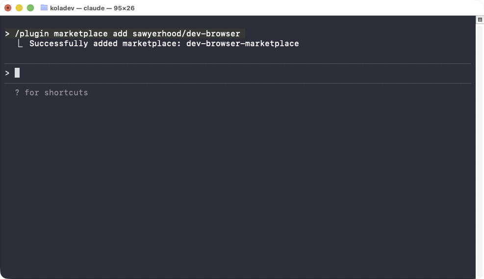
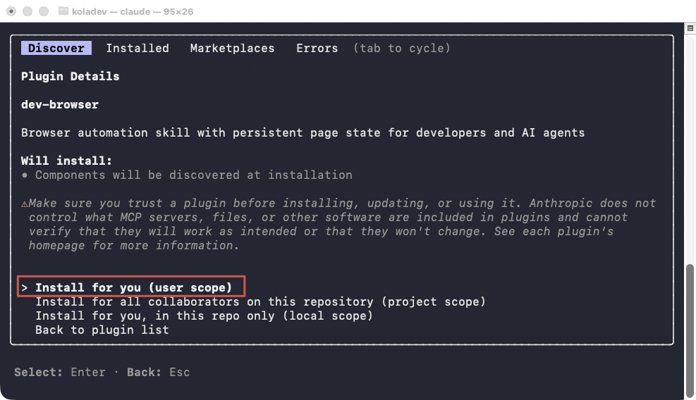
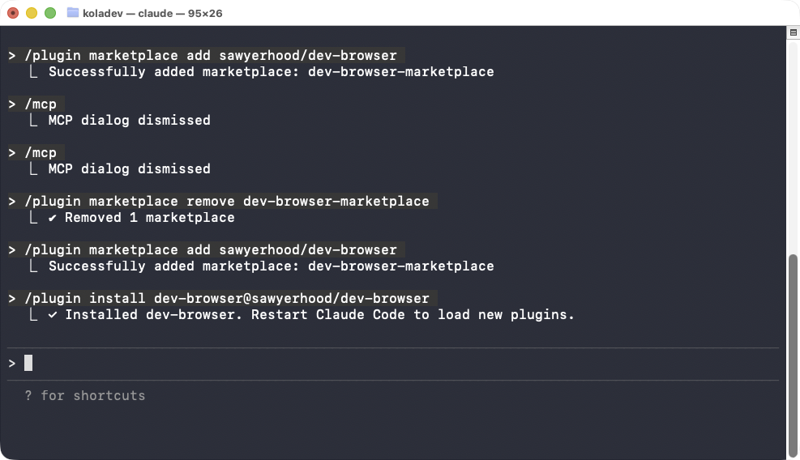
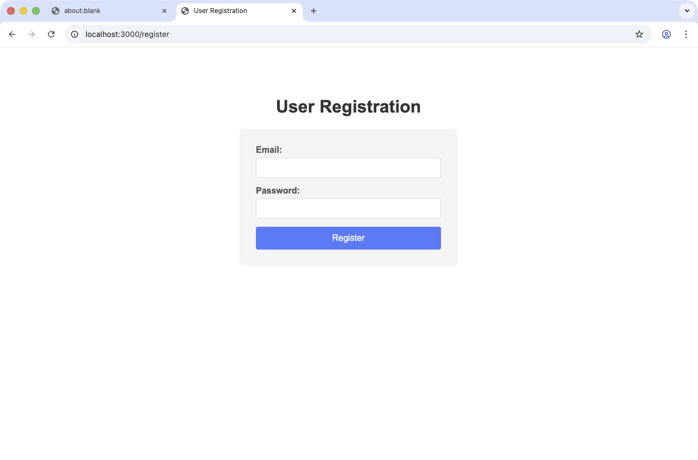
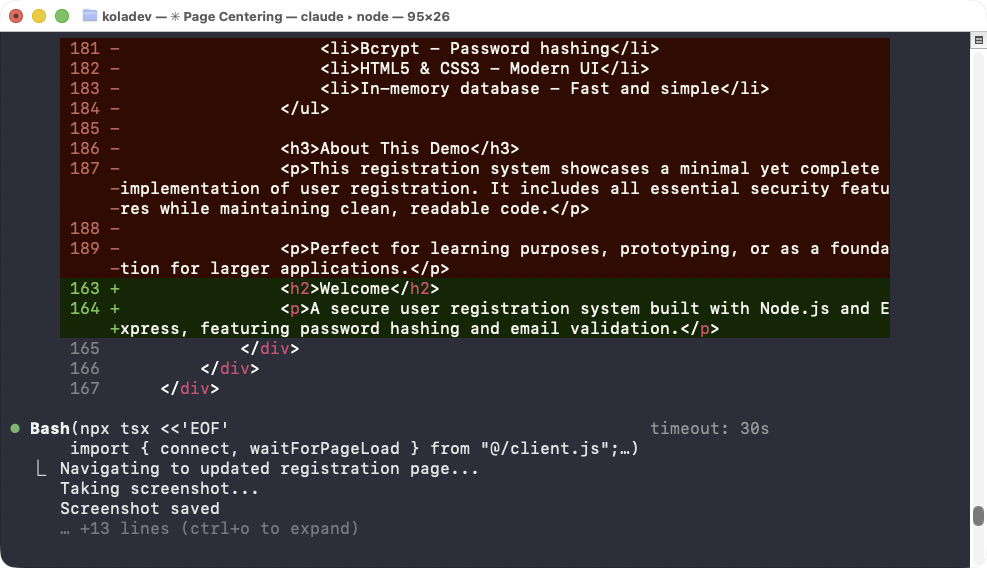

# How to give Claude Code access to a web browser with dev-browser

There is one issue with agentic coding: testing the work. At the end of each work, and mostly big features, you need to make sure the work is done and well done. However, automating the workflow is possible using tools such as Playwright, but the issue is that Playwright runs headless browsers, the agents can't get visual feedback. 

In this article, we are going to use the dev-browser MCP server to allow Claude Code to access the Chrome web browser and test its work. 

## Prerequisites 

For this tutorial, you will need: 

- Claude's code installed
- Node installed
- Google Chrome installed

## Install the MCP server

Open Claude Code in your terminal and enter the following command to install the MCP server: 

```bash
/plugin marketplace add sawyerhood/dev-browser
```



Once it's done, run the following commamnd to install the plugin. 

```bash
/plugin install dev-browser@sawyerhood/dev-browser
```

You will be prompted to choose the installation scope. Choose what works for you, but we are choosing the `Install for you (user scope) option`.



Once it's done, the plugin will be installed.



Restart the Claude Code by exiting the running session and re-entering the Claude Code. 

## Creating a project

To test the installation, let's ask Claude to create a project with a registration page. The goal is simple. We want Claude to run a registration step but also to give visual feedback it can confirm and make a fix about. 

You can use this prompt to create the project.

````bash
Hi Claude,  
Create a minimal Node.js project that implements a user registration feature.

## Requirements

- Use **Node.js with Express**
- Use an **in-memory database** (JavaScript object or `Map`, no external database)
- Provide a **registration page** accessible at `GET /register` with an HTML form
- Handle form submission via `POST /register`
- Store registered users in memory with the following fields:
  - `id`
  - `email` (must be unique)
  - `password` (hashed)
  - `createdAt`
- Validate user input:
  - Valid email format
  - Minimum password length
- Hash passwords using **bcrypt**
- Return clear success and error responses (appropriate HTTP status codes and messages)

## Deliverables

- Project folder structure
- `package.json`
- Server entry point
- In-memory data store implementation
- Minimal HTML for the registration page

## Execution

The project must be runnable using:

```bash
npm install
npm start
```
````

You should have something similar: 


You can also clone the project base directly using this command and direct Claude Code for installation.

```bahs
git clone https://github.com/ritza-co/using-claude-code-with-chrome
```

You can allow Claude Code to install the dependencies and run the project or you can use the following commands: 

```bash
npm install && npm start
```

We will recommand to let Claude Code handle everything. 

## Running the dev-browser plugin

In your Claude terminal, ask Claude to use the dev-browser plugin to test the registration page. 

```txt
Use the dev-browser plugin to run a registration test and make sure the user is created in the database.
```

Claude Code will open the page in Chrome and you will see the registration page. 



After a moment, the registration will happen and you will see the following page. 


That means the user has been registered. 

### Visual feedback

The UI is a bit average, but we can ask Claude to scan the registration page and let us know if the form is centered. We will ask Claude to move the form to the right side and add some centered text on the left side to describe the project.

```txt
Use the dev-browser plugin to analyze the registration page and check whether: (1) the form is positioned on the left side of the screen, and (2) there is descriptive text about the project on the right side.
```



You can see Claude modifying the code, taking a screenshot to analyze the result. You should force Claude to always analyze the changes until the result matches what you are looking for.

## Troubleshooting

The dev-browser implementation excels at testing changes. However, when it comes to visual feedback, your prompts need to be more accurate in what you want, and you need to specify to Claude to keep visiting the page until everything is pixel-perfect.

## Conclusion

In this guide, we learned how to use Claude Code with the dev-browser plugin to allow Claude to test its own work. We did the installation and showed how to use prompts to have the result you want. In the next guide, we will explore how to use the Playwright MCP server to allow Claude to access a browser and test its work.
